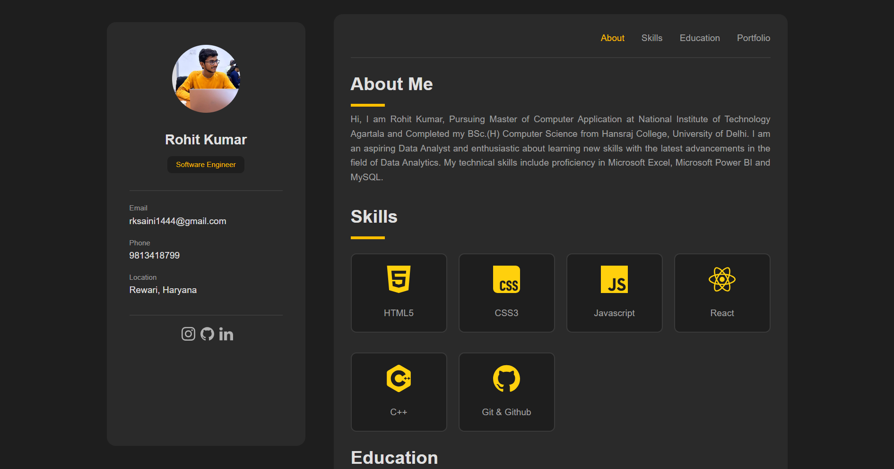

# Personal Profile Website

A simple and clean personal profile website built using **HTML and CSS**. This project showcases basic personal information, skills, and profile details through a simple web interface.

## 🛠️ Technologies Used

* HTML5
* CSS3

## ✨ Features

* Clean and simple profile design
* Responsive layout
* Personal information section
* Skills section
* Social/contact links

## 📂 Project Structure

```text
Personal-Profile/
│
├── index.html
├── style.css
└── images
```

## 🚀 How to Run

1. Clone the repository:

   ```bash
   git clone <your-repository-url>
   ```

2. Open the project folder.

3. Open `index.html` in your browser.

## 📸 Preview

Add a screenshot of your website here:

```markdown

```

## 📌 About the Project

This project was created to practice and strengthen my **HTML and CSS fundamentals**, including page structure, styling, layouts, and responsive design.

## 👨‍💻 Author

**Rohit**

If you like this project, feel free to ⭐ the repository!
